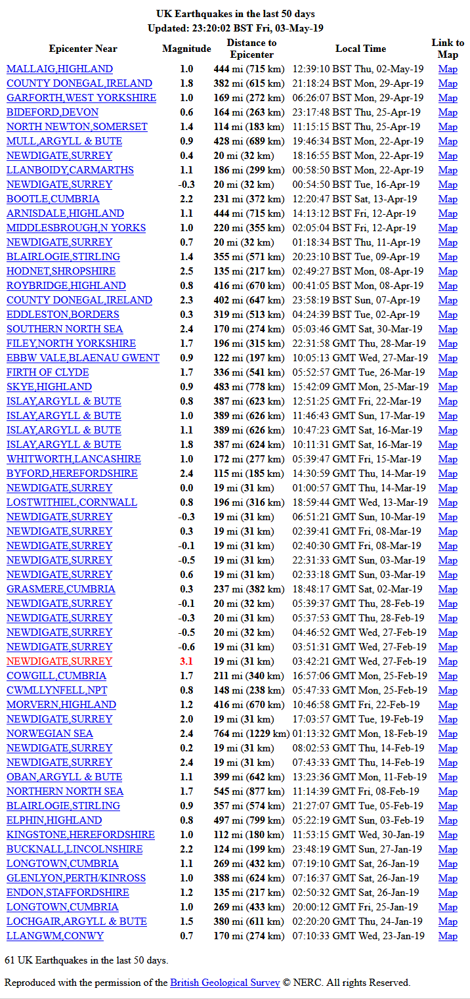

# United Kingdom Earthquake list from UK-BGS


Documentation on how to customize the script is in comments contained in the source and replicated below.

**For anywhere in the United Kingdom**, you just have to change $myLat and $myLong to your station's decimal latitude and longitude to see it work in your area. Defaults are for earthquakes within a 500 km radius. This script uses data from [British Geological Survey](http://www.earthquakes.bgs.ac.uk/recent_events/recent_events.html) website and returns earthquake activity over the last 30 days.

BGS data is used with permission **as long as the attribution built into the script displays with the script output**.

# Script settings
```
// settings:  
//  set $ourTZ to your time zone
//    other settings are optional
//
// cacheName is name of file used to store cached USGS webpage
//
//
  $ourTZ = "Europe/London";  //NOTE: this *MUST* be set correctly to
// translate UTC times to your LOCAL time for the displays.
//  http://saratoga-weather.org/timezone.txt  has the list of timezone names
//  pick the one that is closest to your location and put in $ourTZ
// also available is the list of country codes (helpful to pick your zone
//  from the timezone.txt table
//  http://saratoga-weather.org/country-codes.txt : list of country codes
 $myLat = '51.417';
 $myLong = '-0.434';

 $highRichter = "3.0"; //change color for quakes >= this magnitude

//  pick a format for the time to display ..uncomment one (or make your own)
//$timeFormat = 'D, Y-m-d H:i:s T';  // Fri, 2006-03-31 14:03:22 TZone
//$timeFormat = 'D, Y-M-d H:i:s T';  // Fri, 31-Mar-2006 14:03:22 TZone
  $timeFormat = 'H:i:s T D, d-M-y';  // 14:03:22 TZone Fri, 31-Mar-06
  $cacheFileDir = './';   // default cache file directory
  $cacheName = "quakesUK.txt";  // used to store the file so we don't have to
  //                          fetch it each time
  $refetchSeconds = 1800;     // refetch every nnnn seconds

// end of settings
```

# Sample output


